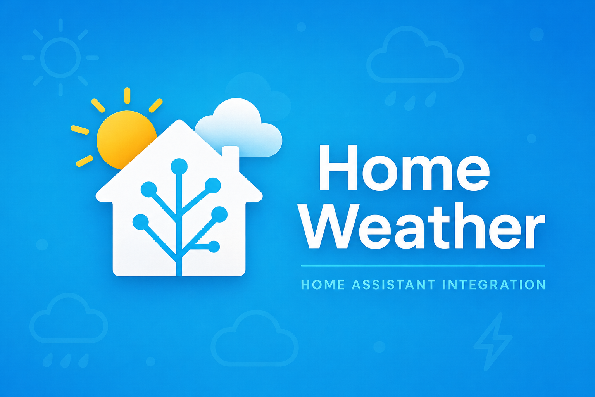

<p align="center">
  
</p>

<p align="center">
  <a href="https://github.com/custom-components/hacs"></a>
  <a href="LICENSE"></a>
  
</p>

A Home Assistant custom integration with a full-screen weather panel, animated conditions, NWS alerts, hurricane tracking, and configurable TTS — all managed from the UI.

## Features

### Dashboard
- **Live conditions** — Animated atmosphere hero with temp, feels-like, wind, UV, humidity, and unified condition labels (Home Assistant + Apple WeatherKit)
- **Forecasts** — 7-day list and 24-hour timeline with detail sheets
- **Radar & charts** — Windy.com map embed plus temperature, precipitation, and wind charts
- **Moon & sun** — Phase, rise/set, solar noon, and day length
- **NWS alerts** — Active warnings with expandable details
- **Hurricane tracker** — NOAA/NHC storm map, forecast cone, and home threat summary
- **Tornado warnings** — Live NWS tornado warning polygons, distance from home, and map-ready GeoJSON entities
- **Responsive** — Mobile-friendly layout with dark theme independent of HA theme

### TTS & alerts
- Scheduled forecasts, sensor triggers, condition-change and upcoming-precip alerts
- Webhooks and voice/conversation weather queries
- Sunrise/sunset announcements and automations
- **NWS siren** — Play a custom sound before alert TTS (config/media)
- Per–media-player volume, preroll, language, and optional AI rewrite

### Settings
Everything is configured in the panel — weather entity, TTS players, triggers, thresholds, webhooks, and NWS options. No YAML required.

## Install

**HACS (recommended)**

1. HACS → Integrations → ⋮ → **Custom repositories**
2. Add `https://github.com/zodyking/home-weather` (category: Integration)
3. Install **Home Weather** and restart Home Assistant
4. Settings → Devices & services → **Add integration** → Home Weather

## Quick start

1. Open **Home Weather** from the sidebar
2. Choose a **weather entity** with daily and hourly forecasts
3. Optionally enable TTS, NWS alerts, or hurricane tracker from Settings
4. Save

## Requirements

- Home Assistant 2024.1+
- Weather entity supporting `weather.get_forecasts` (daily + hourly)
- TTS + media players (for announcements)
- `panel_custom` enabled if the sidebar entry is missing

## Tornado warnings

Home Weather polls the [NWS Alerts API](https://api.weather.gov/alerts/active?event=Tornado%20Warning) every 5 minutes and exposes these entities:

| Entity | Description |
|--------|-------------|
| `binary_sensor.home_weather_tornado_warning` | On when a tornado warning affects your home or configured NWS zone |
| `sensor.home_weather_tornado_alert` | Headline of the highest-priority active warning |
| `sensor.home_weather_tornado_polygon` | `active` / `clear` with map-ready GeoJSON in attributes |
| `sensor.home_weather_tornado_distance` | Distance in miles to the nearest warning polygon |

Tornado warning polygons also appear on the **Hurricane tracker** map in the panel (magenta overlay).

Optional: set `nws_zone` in panel storage (e.g. `NYZ072`) to filter alerts by NWS forecast zone.

### Dashboard example

Native Home Assistant map cards show entity markers but do **not** draw GeoJSON polygons directly. Use the polygon entity attributes with a custom map card, or the built-in Home Weather hurricane/tornado map panel.

```yaml
type: map
entities:
  - entity: zone.home
  - entity: binary_sensor.home_weather_tornado_warning
```

For full polygon rendering, read GeoJSON from `sensor.home_weather_tornado_polygon` attributes (`geojson`, `map_ready: true`) in a custom card or automation, or use the Home Weather panel map.

### Tornado events

Automations can listen for:

- `home_weather_tornado_warning_issued`
- `home_weather_tornado_warning_updated`
- `home_weather_tornado_warning_cleared`

Each event includes `alert_id`, `headline`, `severity`, `urgency`, `expires`, `affecting_home`, `distance_miles`, and `geojson`.

## Issues

Found a bug or want a feature? [Open an issue](https://github.com/zodyking/home-weather/issues).

## Credits

Inspired by the [Weather Forecast Alert Blueprint](https://github.com/zodyking/weather-forecast-alert-blueprint) by [@zodyking](https://github.com/zodyking).
